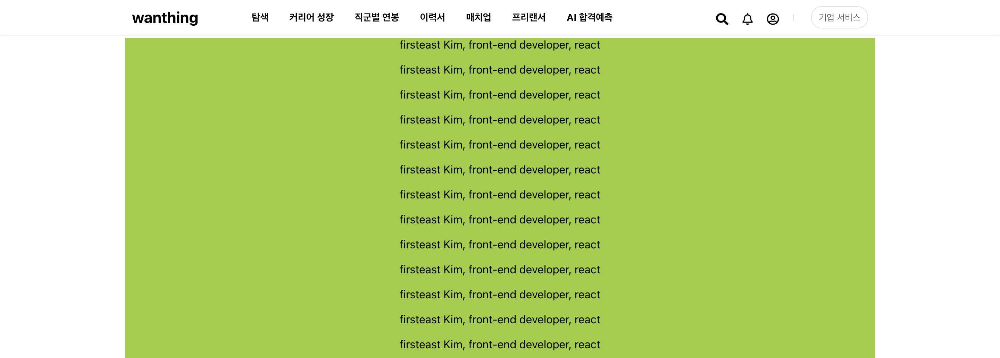

# global-navigation-bar

> 2021년 7월 18일 ~ 8월 17일 
> Practicing Global Navigation Bar(GNB) implementation

<h3 align='center'>Preview</h3>

  

## Stack

  
  
  

## Features

1. 최상단에 고정된 Global Navigation Bar 구현
   * `position: fixed; z-index: 100` : 위치를 항상 고정함
2. `media-query`를 통한 반응형 웹 구현
   * 모바일(width: 649)에 대한 별도의 디자인 적용
    
    
   * 모바일에서 홈, 탐색, 커리어 성장에 마우스를 올릴 때, 어디에 마우스가 올라가있는지 파란색 밑줄로 표시
   * 데스크톱에서 메뉴 항목에 마우스를 올릴 때, 올라간 항목에 회색 밑줄 표시
3. PC 화면에서 탐색에 마우스를 올릴 경우 숨겨져 있는 정보 표시(미완성)
   * 직무 별 세부 정보를 나타내는 창이 표시됨
   * 해당하는 세부 기능은 미구현