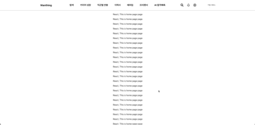
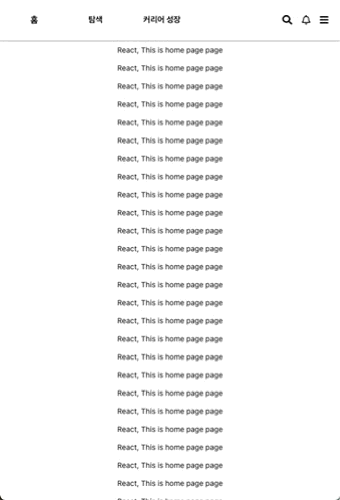
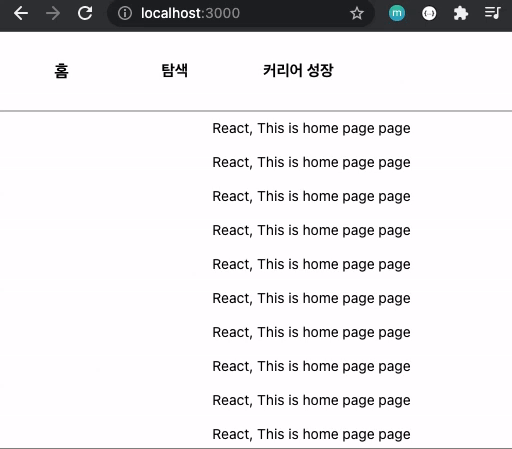

# global-navigation-bar

> 2021년 7월 18일 ~ 8월 17일<br>
> Practicing Global Navigation Bar(GNB) implementation

## 🖇️ Contents
- [global-navigation-bar](#global-navigation-bar)
  - [🖇️ Contents](#️-contents)
  - [💻 Stack](#-stack)
  - [💡 Features](#-features)
    - [1. Global Navigation Bar](#1-global-navigation-bar)
    - [2. Media Query](#2-media-query)
    - [3. CSS selector](#3-css-selector)
    - [4. Routing](#4-routing)
    - [5. Future work](#5-future-work)

<h3 align='center'>Desktop Preview</h3>
<p align='center'>
  
</p>
<h3 align='center'>Mobile Preview</h3>
<p align='center'>
  
</p>

## 💻 Stack
<p>
  
  
  
  
</p>

## 💡 Features

### 1. Global Navigation Bar
   * 페이지 컨텐츠에 상관없이 항상 상단에 고정
   ```css
   position: fixed;
   z-index: 100;
   ```
   
### 2. Media Query
   * `media-query`를 통한 반응형 웹`responsive web` 구현
     * 650px를 기준으로 데스크톱-태블릿과 모바일 화면 구분
     * 각 화면에 해당하는 GNB를 반응형으로 표시
     ```css
     @media(min-width: 650px) {
       /* desktop & tablet style */
     }
     @media(max-width: 649px) {
       /* mobile style */
     }
     ```
   
### 3. CSS selector
   * `CSS selector`를 통한 UX 개선
   * `:hover`
      * 데스크톱-태블릿 :: 탐색 ~ AI합격예측 사이에서 마우스가 올라간 항목 회색 밑줄 표시
      * 모바일 :: 홈, 탐색, 커리어 성장에 마우스가 올라간 항목 파란색 밑줄 표시
   * 데스크톱에서 메뉴 항목에 마우스를 올릴 때, 올라간 항목에 회색 밑줄 표시
   * `:link, :visited`
      * 기본 링크 스타일 제거

### 4. Routing
   * `react-router-dom`을 통한 라우팅 기능 구현
     * / : 홈 버튼 클릭 시 홈 페이지임을 표시
     * /search : 탐색 페이지 클릭 시 탐색 페이지임을 표시
     * /career : 커리어 성장 클릭 시 커리어 성장 페이지임을 표시
 <p align='center'>
  
</p>

### 5. Future work
   * PC 화면에서 탐색에 마우스를 올릴 경우 숨겨져 있는 정보 표시(구현 중)
   * 직무 별 세부 정보를 나타내는 창이 표시됨
